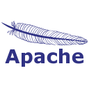

### Hi, I'm Linards! 👋

Currently I'm a student at University of Latvia studying to get a Bachelor's degree in Computer Science. I am fascinated by how the web works and I'm actively learning new languages and tools to eventually be able to build websites and apps that I can be proud of and that can make an impact and help people in their daily lives.

## Languages and Tools:

## Contact me on:

